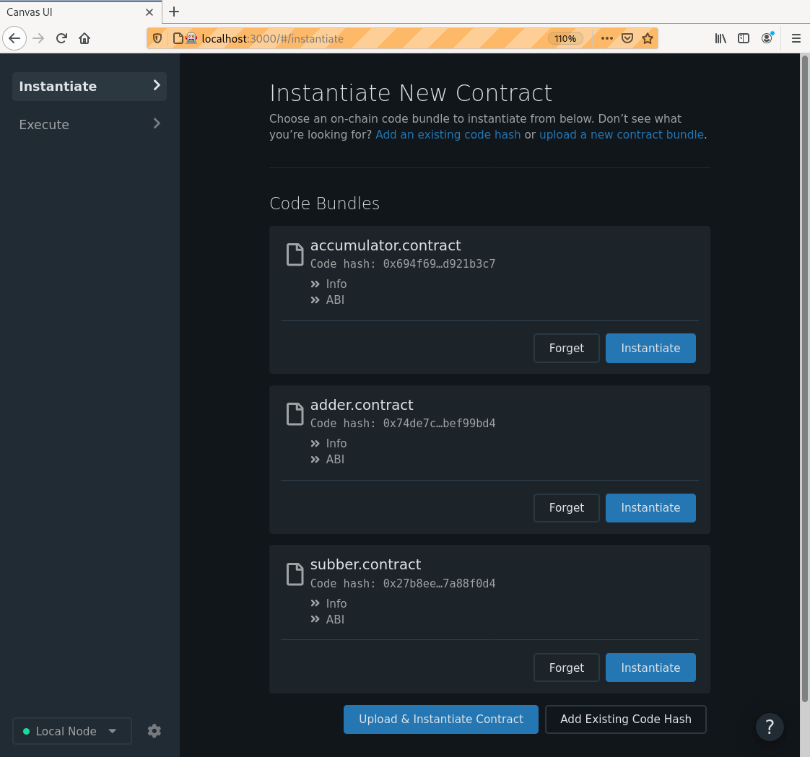

# `MultiContractCaller` Smart Contract

The `multi_contract_caller` smart contract is our showcase for executing other smart
contracts on-chain.

It consists in total of 4 different smart contract:

- `MultiContractCaller` (root): Calls either to the Adder or Subber smart contract
- `Adder`: Increases a value in the Accumulator smart contract
- `Subber`: Decreases a value in the Accumulator smart contract
- `Accumulator`: Owns a simple `i32` value that can be incremented or decremented

In order to test this bundle of smart contracts you need to execute the
following steps.

is an easy way to get a local smart contract chain running.

1. Compile all contracts using the `./build-all.sh` script.
You will receive the respective `.contract` bundles for all the smart contracts in the `target/ink/` folder:
* `target/ink/multi_contract_caller.contract`
* `target/ink/adder/adder.contract`
* `target/ink/subber/subber.contract`
* `target/ink/accumulator/accumulator.contract`
1. Upload the `.contract` bundle of Accumulator, Adder and Subber to the chain.
1. Note down the respective code hashes of the uploaded contracts. You can
   
1. Instantiate the `MultiContractCaller` smart contract given all of the code hashes and a starting value.
Make sure the endowment is big enough (if you're using our `ink-node` it's `1000000`).
The `MultiContractCaller` smart contract will take over the work of instantiating the other smart contracts for you.
1. Now you are able to run the operations provided by the `MultiContractCaller` smart contract.
Namely `get` to call to either the Adder or the Subber to either increase or decrease
the value stored in the Accumulator smart contract respectively and `switch` to switch the currently
called smart contract.
The initially called smart contract is the Adder.

 

> __Note:__ 
> and get the error `ExtrinsicFailed: OutOfGas`.
> As a workaround set the maximum allowed gas manually (e.g. to 5000).

